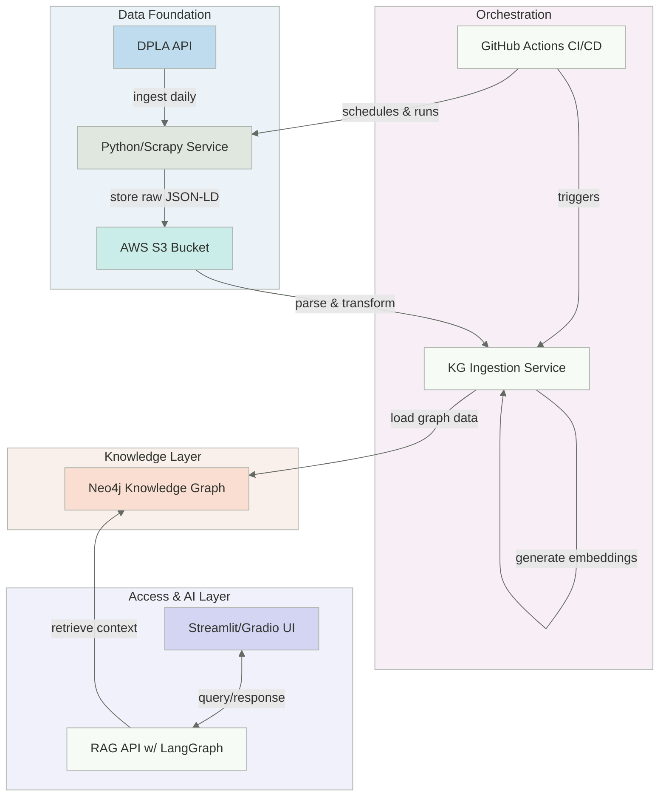

# The Severance Protocol

> A 10-week public sprint building an archival system that ingests and models the DPLA's federated cultural heritage data. Culminates in a conversational AI powered by a Neo4j knowledge graph and GraphRAG architecture. **Stack:** Python, Terraform, Docker, GitHub Actions, LangGraph.

---

## 📖 Table of Contents

-(#-the-narrative)
-(#-live-demo)
-(#-proposed-system-architecture)
-(#-planned-tech-stack)
-(#-running-locally)
-(#-design-decisions--trade-offs)
-(#-weekly-progress-log)

## 🧠 The Narrative

"The Severance Protocol" is a 10-week, public R&D sprint to build a complete, AI-powered archival system from scratch. It reframes a career transition as a self-directed research fellowship.

Inspired by the themes of the show "Severance," this project is a practical exploration of memory, identity, and data integrity within complex systems. It is not just a project done _during_ a period of professional severance; it is a protocol designed to prevent the _data severance_ — the loss of an artifact's context, provenance, and history over time.

This project serves as a practical application of research I've conducted throughout my Information Studies PhD studies and candidacy, focusing on creating better, more scalable, and more reproducible infrastructure via the mastery of engineering skills (e.g., building automated pipelines, designing robust data models, and ensuring data integrity).

## 🚀 Live Demo

> **Coming in Week 9!** The final, deployed application will be linked here.

---

## 🏗️ Proposed System Architecture

This diagram represents the target end-to-end architecture for the 10-week sprint. The system is designed to operationalize the data engineering lifecycle: from generation and ingestion to storage, transformation, and serving.

## 🛠️ Planned Tech Stack

| Category             | Technology                                 | Purpose                                                                                                                                                                                       |
| -------------------- | ------------------------------------------ | --------------------------------------------------------------------------------------------------------------------------------------------------------------------------------------------- |
| **Data Ingestion**   | Python, Scrapy                             | Fetching and parsing complex JSON-LD from the DPLA API.                                                                                                                                       |
| **Cloud Storage**    | AWS S3                                     | Scalable, durable storage for the raw, immutable data archive.                                                                                                                                |
| **Infrastructure**   | Terraform                                  | Defining and managing cloud infrastructure using config files for reproducibility (IaC).                                                                                                      |
| **Orchestration**    | GitHub Actions                             | Automating the entire data pipeline on a daily schedule (CI/CD).                                                                                                                              |
| **Database**         | Neo4j Community Edition                    | Modeling the complex, inter-entity relationships inherent in the DPLA's federated dataset. Self-hosting via Docker ensures reproducibility via versioned, containerized, authentic instances. |
| Embeddings           | Sentence Transformers (`all-MiniLM-L6-v2`) | Generating vector embeddings locally for semantic search, ensuring data privacy and long-term reproducibility.                                                                                |
| **AI / Backend**     | Groq (LLM), LangGraph, FastAPI             | Building a stateful, self-correcting GraphRAG agent to interact with the knowledge graph.                                                                                                     |
| **Containerization** | Docker, Docker Compose                     | Packaging the entire application for consistent, isolated, and reproducible deployments.                                                                                                      |
| **Frontend**         | Streamlit / Gradio                         | Rapidly building a simple, interactive user interface for the live demo.                                                                                                                      |

## 🏃 Running Locally

> **Coming in Week 8!** Instructions to run the final, containerized application will be added here as the project progresses.

### Prerequisites

- Git
- Docker and Docker Compose
- AWS account with credentials configured locally
- [DPLA API Key](https://pro.dp.la/developers/policies#get-a-key)
## 🤔 Design Decisions & Trade-offs

This project required several key architectural decisions. This section documents the rationale behind them.

#### Why the DPLA Dataset?
The Digital Public Library of America (DPLA) dataset was chosen because it presents several real-world challenges I'm interested in tackling:
- **Federated Data:** The DPLA aggregates metadata from over 1,600 institutions, resulting in a heterogeneous dataset that requires robust parsing and normalization.
- **Complex Schema:** The data is served as JSON-LD and conforms to the DPLA Metadata Application Profile (MAP), a sophisticated, multi-layered schema. Modeling this data is a non-trivial engineering task that directly informs the development of a formal ontology.

#### Why a Knowledge Graph for RAG?
While a standard vector database is a common choice for RAG applications, this project uses a Neo4j knowledge graph as the foundation for its AI. This approach, often called GraphRAG, was chosen to mitigate a key weakness in vector-only systems: **context poisoning**.
- Vector search can retrieve documents that are semantically similar but contextually irrelevant, leading the LLM to generate misleading answers that compromise the integrity of the information being served.
- By using a knowledge graph, we can perform a hybrid retrieval process: first, use vector search to find the most relevant *entry points* into the graph, then use the explicit, curated relationships to traverse the graph and retrieve a rich, highly relevant, and explainable *subgraph* of context to feed to the LLM. This leads to more accurate and trustworthy responses.
#### Why Self-Hosted Neo4j Community Edition?
The decision to use the self-hosted Neo4j Community Edition over a managed cloud service like Aura was driven by the project's core research goals by offering advantages in **reproducibility and archival integrity**. By self-hosting within a Docker container, the exact database version, data, and application code can be packaged into a single, version-controlled artifact.
#### Why Terraform for Infrastructure?
All cloud resources (specifically the S3 bucket) are managed using Terraform. This Infrastructure as Code (IaC) approach was chosen over manual console setup to demonstrate best practices in building reproducible and version-controlled systems. It ensures that the entire infrastructure can be torn down and rebuilt identically with a single command.

## 🗓️ Weekly Progress Log

This project is being built in public over a 10-week period. You can follow the journey on LinkedIn via the [#theseveranceprotocol](https://www.linkedin.com/feed/hashtag/?keywords=theseveranceprotocol) hashtag. Links to the weekly update posts will be added as they are published.

| Week | Theme                             |     Status     | LinkedIn Post |
|:----:| --------------------------------- |:--------------:|:-------------:|
|  1   | The Ingestion Engine              | 🚧 In Progress |               |
|  2   | The Cloud Archive                 |  ⏳ Upcoming   |               |
|  3   | The Automated Orchestrator        |  ⏳ Upcoming   |               |
|  4   | The Knowledge Graph Model         |  ⏳ Upcoming   |               |
|  5   | KG Ingestion                      |  ⏳ Upcoming   |               |
|  6   | The Formal Ontology               |  ⏳ Upcoming   |               |
|  7   | The RAG Retriever                 |  ⏳ Upcoming   |               |
|  8   | Containerization                  |  ⏳ Upcoming   |               |
|  9   | Continuous Deployment & Live Demo |  ⏳ Upcoming   |               |
|  10  | Project Wrap & Retrospective      |  ⏳ Upcoming   |               |
