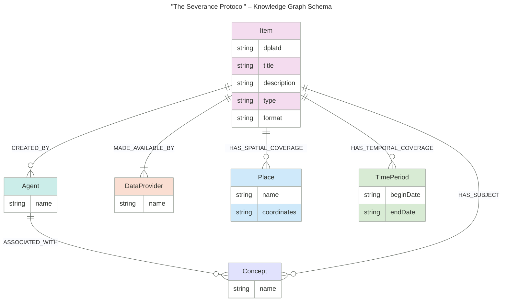

# Knowledge Graph Schema Directive for "The Severance Protocol"

Based on the project's goals of mitigating "data severance" and enabling advanced querying, the knowledge graph schema must be designed with a strategic, minimal set of properties. The focus is on depth and utility, not exhaustive data mapping. The following directive outlines the core entities, relationships, and properties required for a Minimum Viable Product (MVP).

1. Strategic Guiding Principles
	- **Thematic Relevance:** Properties must directly support the project's core theme of preserving an artifact's provenance, origin, and context.
	- **Analytical Power:** Properties must enable the discovery of interesting graph patterns, such as cycles and isomorphisms.
	- **RAG UI Utility:** Properties must be the foundation for complex, multi-hop user queries.

2. Recommended MVP schema
	- This schema maps 13 core properties across six primary entity types. This scope is manageable for a 10-week timeline while providing sufficient data for the project's use cases.

## **Core Entities and Properties**

- **Item** (Cultural Artifact)
    - `dplaId` (unique identifier)
    - `title`
    - `description`
    - `type` (e.g., "image", "text")
    - `format` (e.g., "image/jpeg")
- **Agent** (Creator)
    - `name`
- **DataProvider** (Institution)
    - `name`
- **Place** (Location)
    - `name`
    - `coordinates` (for geospatial analysis)
- **TimePeriod** (Era)
    - `beginDate`
    - `endDate`
- **Concept** (Subject)
    - `name`

## **Core Inter-Entity Relationships**

The following relationships are critical for enabling multi-hop reasoning and analytical patterns:
- `(Item)-[:MADE_AVAILABLE_BY]->(DataProvider)` (One-to-one-or-more, mandatory)
- `(Item)-[:CREATED_BY]->(Agent)` (One-to-zero-or-more, optional)
- `(Item)-[:HAS_TEMPORAL_COVERAGE]->(TimePeriod)` (One-to-zero-or-more, optional)
- `(Item)-[:HAS_SPATIAL_COVERAGE]->(Place)` (One-to-zero-or-more, optional)
- `(Agent)-[:ASSOCIATED_WITH]->(Concept)` (One-to-zero-or-more, optional)
- `(Item)-[:HAS_SUBJECT]->(Concept)` (One-to-zero-or-more, optional)

This focused approach allows for immediate progress on the core application logic while maintaining the flexibility to add more properties in the future as the project evolves.

